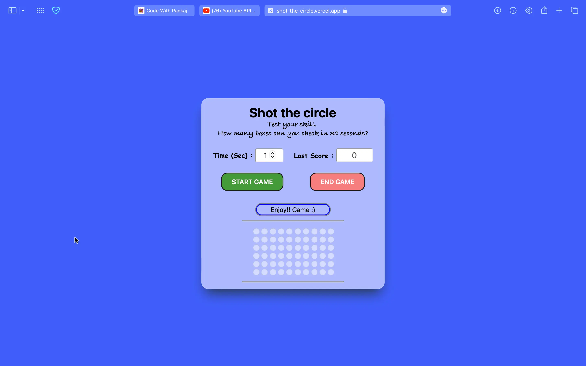

# Shot-The-Circle-JavaScript-Game

Using web languages like HTML, CSS, and JavaScript, this repository makes a shoot-the-circle game that's interactive. When you click on the points indicators, you will receive a plus point if you click right, but if you click incorrectly, you will receive a minus point. The access link can be found below.
## Features
- Interactive UI
- Click on start game button to start the game
- Also have a feature to calculate user click & mouse points.
- You have to click on the indicator which is generated by computer,
- If you both click same place at once then you got plus point 1 every time,
- If you click different places at same time you got minus 1 every time.

## Authors

- [@pankajkumar90](https://www.github.com/pankajkumar90)


## Contributing

Contributions are always welcome!

See `index.html` for ways to get started.

Please adhere to this project's `code of conduct`.


## Demo

https://shot-the-circle.vercel.app
<br><br>
https://github.com/Pankajkumar90/Shot-The-Circle-JavaScript-Game.git


## Feedback

If you have any feedback, please reach out to us at pankajbaliyan90@gmail.com


## 🔗 Links
[](https://codewithpankaj.vercel.app)

[](https://www.linkedin.com/in/pankaj-kumar-90/)

## Lessons Learned

I learned many things while making this repository, i.e. how to do make a interactive game using HTML, CSS, JavaScript, which capture mouse clicks and give response according to user clicks.

## Run Locally

Clone the project

```bash
  git clone https://github.com/Pankajkumar90/Shot-The-Circle-JavaScript-Game.git
```

Go to the project directory

```bash
  cd my-project
```

Start code editor

```bash
  code .
```


## Screenshots




## Support

For support, email pankajbaliyan90@gmail.com or join our Slack channel.

